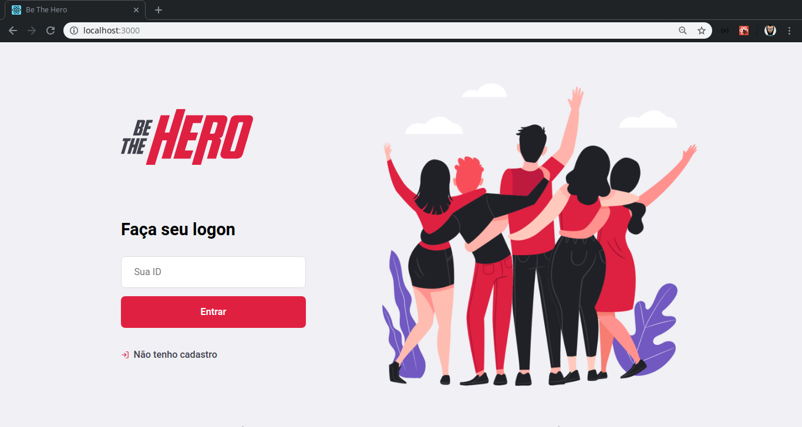

# Be The Hero

> Aplicação Omnistack desenvolvida com React, React Native e Node js

> Be The Hero simula sistema onde ONGS que pode divulgar casos em que precisa de ajuda financeira e por meio do aplicativo os Herois (doadores) podem escolher um caso ou mais para ajudar	

## FontEnd

- [ ] Cadastro

- [ ] Logar

- [ ] Listar Casos

- [ ] Registrar novo caso

  ### Dependencias

```json
"dependencies": {
    "celebrate": "^12.0.1",
    "cors": "^2.8.5",
    "express": "^4.17.1",
    "knex": "^0.20.13",
    "sqlite3": "^4.1.1"
  },
  "devDependencies": {
    "jest": "^25.2.7",
    "nodemon": "^2.0.2",
    "supertest": "^4.0.2",
    "cross-env": "^7.0.2"
  }
```




## Getting started

### Fontend

```bash
cd frontend/
```

* Instalar dependencias

  ```bash
  npm install
  ```

* Iniciar

  ```bash
  npm start
  ```

A aplicação será iniciada porta `3000`, para acessar utilize

```http
http://localhost:3000
```


### BackEnd (API)

```bash
cd backend/
```

* Instalar dependencias

  ```bash
  npm install
  ```

* Instalar migartions (database) [cria um banco de dados .sqlite]

  ```bash
  npx knex migrate:latest
  ```

* Iniciar

  ```bash
  npm start
  ```

### Mobile


